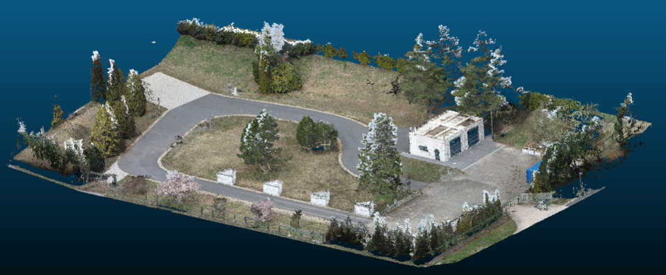
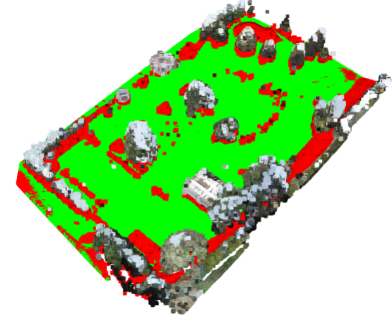
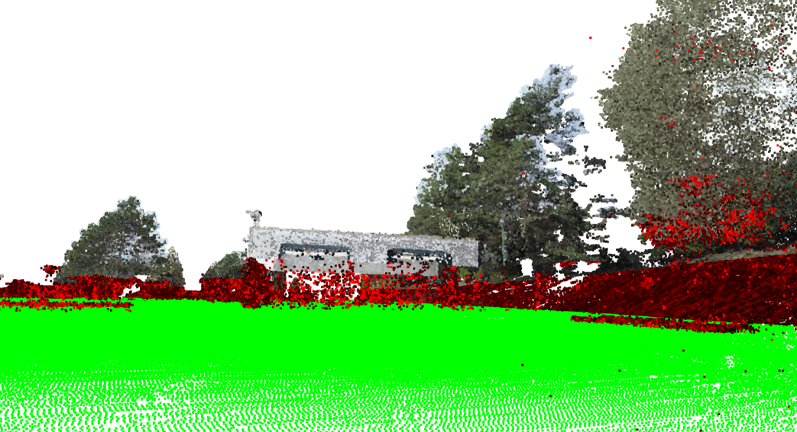

# Traversability analysis for outdoor scenarios

This project performs traversability analysis on 3D point cloud data for robotic navigation using Python and Open3D.

The pipeline detects the ground plane, estimates surface normals, identifies obstacles, and visualizes navigable areas for a mobile robot.

---

## Features

- Point cloud loading and visualization
- Voxel downsampling
- Plane segmentation using RANSAC
- Ground extraction
- Surface normal estimation
- Obstacle detection based on angular deviation
- Height-based filtering according to robot dimensions
- Interactive parameter tuning with Tkinter GUI

---

## Technologies

- Python
- Open3D
- NumPy
- Tkinter

---

## Pipeline Overview

### 1. Point Cloud Loading

The `.pcd` point cloud is loaded using Open3D.

### 2. Downsampling

Voxel downsampling reduces the number of points for faster processing.

### 3. Ground Plane Segmentation

RANSAC plane fitting is applied to detect the ground surface.

### 4. Surface Normal Analysis

Normals are estimated for non-ground points.

### 5. Obstacle Detection

Points whose normals significantly differ from the ground plane normal are classified as obstacles.

### 6. Height Filtering

Obstacle regions are filtered according to the robot height constraints.

### 7. Visualization

The algorithm visualizes:
- Navigable area (green)
- Restricted/obstacle area (red)

---

## Project Structure

```text
data/       -> Input point cloud files
src/        -> Source code
results/    -> Visualizations and reports
```

---

## Installation

```bash
pip install -r requirements.txt
```

---

## Usage

Update the point cloud path inside the script:

```python
path_to_pcd = "your_path/cloud.pcd"
```

Run the application:

```bash
python src/traversability_analysis.py
```

---

## Parameters

The graphical interface allows dynamic adjustment of:

- Distance threshold
- Robot length
- Robot width
- Robot height

---

## Results

Original 3D Point Cloud


Example visualization of traversable space detection:


Green regions represent navigable terrain.\
Obstacle regions are filtered based on geometry and robot dimensions. Red regions represent this obstacles.

Point of View from the Robot


---

## Future Improvements

- Real-time point cloud processing
- ROS integration
- Multi-plane segmentation
- GPU acceleration
- Autonomous path planning integration

---

## Authors

David Enrique Veloz Renteria\
Maria Alejandra Guzman Alfaro\
Sara Lucía Montaño Gamarra

